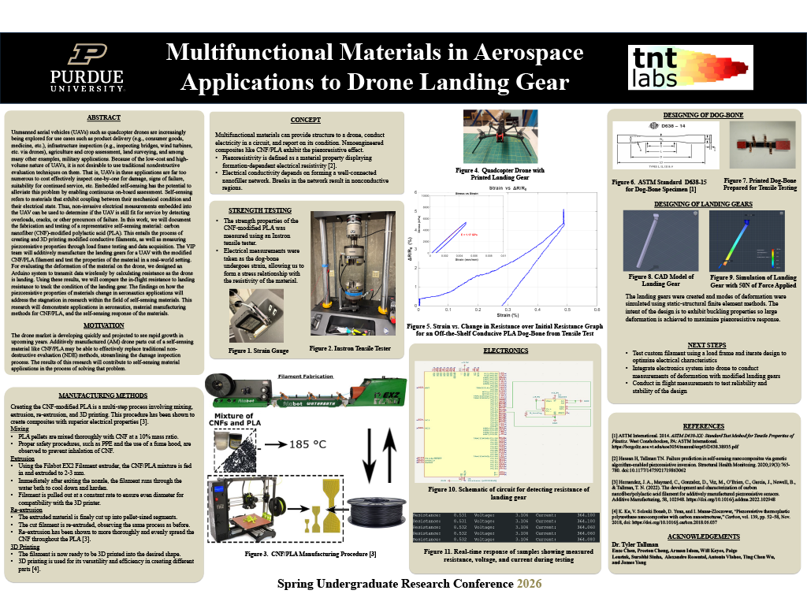
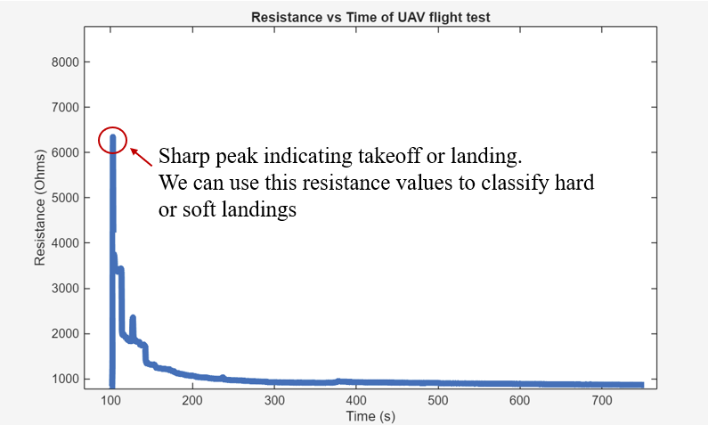
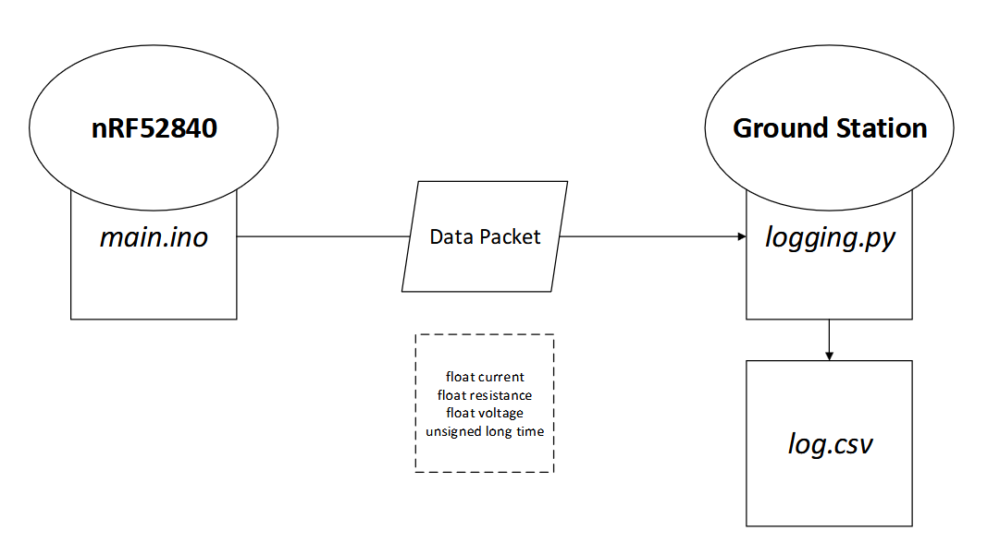

# SMART MATERIALS for Self Sensing UAVS

*Proof of Concept Prototype*

## Overview

Many materials exhibit intrinsic electro-mechanical coupling, meaning that simple electrical measurements can be used to infer stress, strain, damage, and structural health. Understanding and leveraging this coupling has transformative potential in biomedical technology, structural health monitoring, robotics, and geospatial imaging. This project specifically explores these properties for unmanned aerial vehicle (UAV) applications.

## Why it Matters

Unmanned aerial vehicles are rapidly expanding into critical applications including:

- Product delivery (consumer goods, medical supplies)
- Infrastructure inspection (bridges, wind turbines, power lines)
- Agriculture and crop assessment
- Land surveying and mapping
- Search and rescue operations
- Military applications

Traditional nondestructive evaluation (NDE) techniques are impractical for UAV fleets. These aircraft are too numerous and operate too frequently to cost-effectively inspect one-by-one for damage, signs of failure, or continued airworthiness. Embedded self-sensing has the potential to alleviate this problem by enabling continuous on-board assessment. By detecting overloads, cracks, and other failure precursors in real-time, we can determine whether a UAV remains fit for service without manual inspection.

*Example using data from our tests (drone_demo_tallman.txt)*

## What We Did

We additively manufactured UAV landing gear using carbon nanofiber (CNF) reinforced PLA filament and validated the material's sensing capabilities in real-world flight conditions. To evaluate structural deformation during operation, we designed a wireless data transmission system that calculates electrical resistance in real-time as the drone lands, providing immediate feedback on impact forces and potential damage. When the material encounters stress, the resistance of the material changes. In this instance, if the aircraft encounters a harsh landing, the overall resistance of the material increases.

## System Architecture

`/src
`Contains the .ino and .cpp files necessary for flashing onto board. The nRF52840 wireless transmits a data packet containing resistance, voltage, current, and timestamp values using BLE (polling ~100 ms)

> main.ino

---

`/logging
`Contains the python and MATLAB files neccesary for capturing data packet.

> logging_resistance_data_packet.py - Catches the data packet our board transmits and logs the data into a structured CSV file
>
> scanner.py - Scans all BLE devices in area and gives the devices address
>
> analyzeLogData.m - Imports CSV data from our tests and plots figures to analyze the data

## Materials

- nRF52840
- INA226
- Additively Manufactured CNF/PLA Landing Gears
