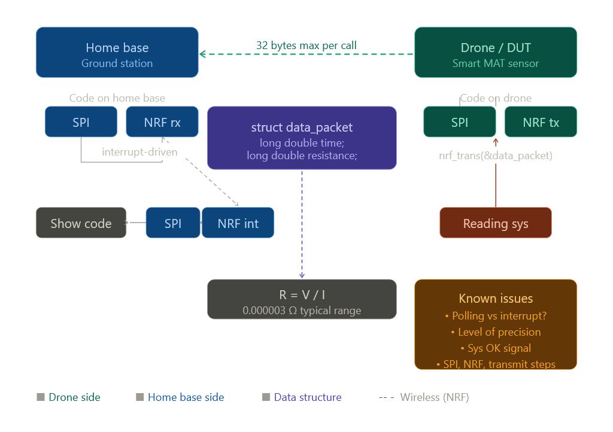

# Old System Design

## Materials

- NRF24L01
- ATmega328p
- INA226
- Additively Manufactored CNF/PLA Landing Gears

## System Design

1. Home Base: System on the ground receiving (RF) data transmitted live from the drone about the resistance measurments and logs the data.
2. Onboard Sensor System: System on the drone measuring current and voltage values then calculating resistance and transmitting them (RF) to home base.
 